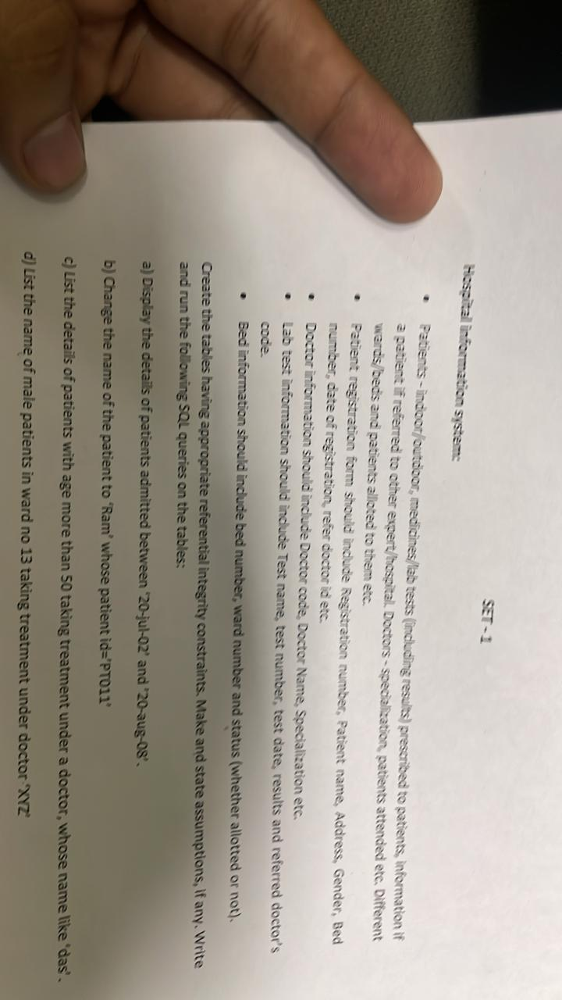

# DBMS-lab

# DBMS Lab PL/SQL Examples

This document contains PL/SQL examples for MySQL.

## Procedure to Calculate Factorial

This section demonstrates a PL/SQL procedure to calculate the factorial of a given number.

```sql
delimiter //
create procedure fact()
begin
    declare n int default 7;
    declare res int default 1;
    while n > 0 do
        set res=res*n;
        set n=n-1;
    end while;
    select res;
end //
call fact //
```

## Procedure to Reverse a Number

This section illustrates a PL/SQL procedure to reverse a given number.

```sql
delimiter //
create procedure rev()
begin
    declare rev int default 0;
    declare n int default 5369;
    while n > 0 do
        set rev = rev * 10 + mod(n,10);
        set n = floor(n/10);
    end while;
    select rev;
end //
call rev() //
```

## Procedure to Generate Fibonacci Series

This section showcases a PL/SQL procedure to generate a Fibonacci series.

```sql
delimiter //
create procedure fibo()
begin
    declare n int default 5;
    declare a int default 0;
    declare b int default 1;
    declare fib int;
    while n > 0 do
        select a as fibonacci;
        set fib = a + b;
        set a = b;
        set b = fib;
        set n = n - 1;
    end while;
end //
call fibo() //
```

## Procedure to Calculate Area of Circles

This section presents a PL/SQL procedure to calculate the area of circles with varying radii.

```sql
delimiter //
create procedure area()
begin
    declare pi double default 3.14;
    declare ar double default 0.0;
    declare i int default 3;

    create table ar(radius int,area double);

    while i < 8 do
        set ar = pi * i * i;
        insert into ar values (i,ar);
        set i = i + 1;
    end while;
    select * from ar;
end //
call area() //
```

## Procedure for Debiting From Account

This section describes a PL/SQL procedure for debiting a specific amount from an account, given its account number.

```sql
DELIMITER //

CREATE PROCEDURE DebitFromAccount(IN account_no VARCHAR(24))

BEGIN

    DECLARE b_balance FLOAT;

    

    -- Check if the account exists and retrieve its balance

    SELECT Balance INTO b_balance

    FROM Accounts

    WHERE Account_id = account_no;

    

    -- Debit Rs. 2000 if the account has a minimum balance of Rs. 500 after the debit

    IF b_balance >= 2500 THEN

        UPDATE Accounts

        SET Balance = Balance - 2000

        WHERE Account_id = account_no;

        

        SELECT 'Rs. 2000 debited successfully from account ' AS Message, balance from Accounts where Account_id = account_no;

    ELSE

        SELECT 'Insufficient balance to perform the transaction.' AS Message;

    END IF;

END //
```

## Procedure for Transferring Amount Between Accounts

This section explains a PL/SQL procedure for transferring a specified amount from one account to another.

```sql
DELIMITER //


CREATE PROCEDURE TransferAmount(

    IN p_sender_id VARCHAR(24),     

    IN p_receiver_id VARCHAR(24),  
    
    IN p_receiver_name VARCHAR(5),

    IN p_transfer_amount FLOAT     

)

BEGIN

    DECLARE v_sender_balance FLOAT;     

    DECLARE v_receiver_balance FLOAT;   

    

    -- Check if sender and receiver accounts exist and retrieve their balances

    SELECT Balance INTO v_sender_balance

    FROM Accounts

    WHERE Account_id = p_sender_id;

    

    SELECT Balance INTO v_receiver_balance

    FROM Accounts

    WHERE Account_id = p_receiver_id and Name = p_receiver_name;

    

    -- Check if sender and receiver accounts exist and their balances are retrieved

    IF v_sender_balance IS NOT NULL AND v_receiver_balance IS NOT NULL THEN

        -- Transfer amount if sender has sufficient balance

        IF v_sender_balance >= p_transfer_amount THEN

          

            UPDATE Accounts

            SET Balance = Balance - p_transfer_amount

            WHERE Account_id = p_sender_id;

            

            -- Credit to receiver

            UPDATE Accounts

            SET Balance = Balance + p_transfer_amount

            WHERE Account_id = p_receiver_id;

            

            SELECT 'Transfer of Rs. ', p_transfer_amount, ' from account ', p_sender_id, ' to account ', p_receiver_id, ' successful.' AS Message;

        ELSE

            SIGNAL SQLSTATE '45000'

            SET MESSAGE_TEXT = 'Insufficient balance in account ' ;

        END IF;

    ELSE

        SIGNAL SQLSTATE '45000'

        SET MESSAGE_TEXT = 'Invalid account number or name.';

    END IF;


END//
```

## Table Creation and Data Insertion

This section provides SQL commands for creating a table and inserting data into it.

```sql
create table Accounts(Account_id varchar(255), Name varchar(255),Balance float);

insert into Accounts values ('AC 001','A',5000),('AC 002','B',10000),('AC 003','D',5000),('AC 004','E',2000),('AC 005','C',250);
```

# set1.jpeg


## The image you sent contains a hospital information system design including details about patients, doctors, wards, and beds. It also outlines a patient registration form, doctor information, lab test information, and bed information.

Here are some SQL queries you can write based on the information provided in the image:

a) Display the details of patients admitted between 20-Jul-2002' and '20-Aug-2008'

SQL
```sql
SELECT * FROM Patients-Indoor/outdoor
WHERE date_of_registration BETWEEN '2002-07-20' AND '2008-08-20';
```
Use code with caution.
b) Change the name of the patient to "Ram" whose patient id='PT011'"

SQL
```sql
UPDATE Patients-Indoor/outdoor
SET Patient_name = 'Ram'
WHERE Registration_number = 'PT011';
```
Use code with caution.
c) List the details of patients with age more than 50 taking treatment under a doctor, whose name like 'das'

SQL
```sql
-- Assuming there's an 'Age' field in the Patients-Indoor/outdoor table
SELECT * FROM Patients-Indoor/outdoor p
INNER JOIN Doctors d ON p.refer_doctor_id = d.Doctor_code
WHERE p.Age > 50 AND d.Doctor_name LIKE '%das%';
```
Use code with caution.
d) List the name of male patients in ward no 13 taking treatment under doctor XYZ'

SQL
```sql
SELECT Patient_name FROM Patients-Indoor/outdoor p
INNER JOIN Doctors d ON p.refer_doctor_id = d.Doctor_code
INNER JOIN Bed b ON p.Bed_number = b.bed_number
WHERE b.ward_number = 13 AND b.status = 'Alloted' AND d.Doctor_name = 'XYZ' AND p.Gender = 'Male';
```
Use code with caution.
Assumptions:

The tables are named Patients-Indoor/outdoor, Doctors, Lab test Information, and Bed information as mentioned in the image.
There is an 'Age' field in the Patients-Indoor/outdoor table.
The doctor name can be searched by like operator.
A bed can be allocated to one patient at a time (represented by the 'Alloted' status in the Bed table).